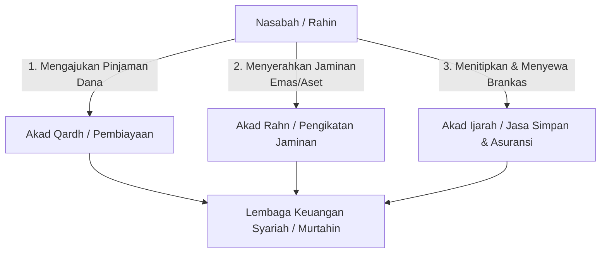
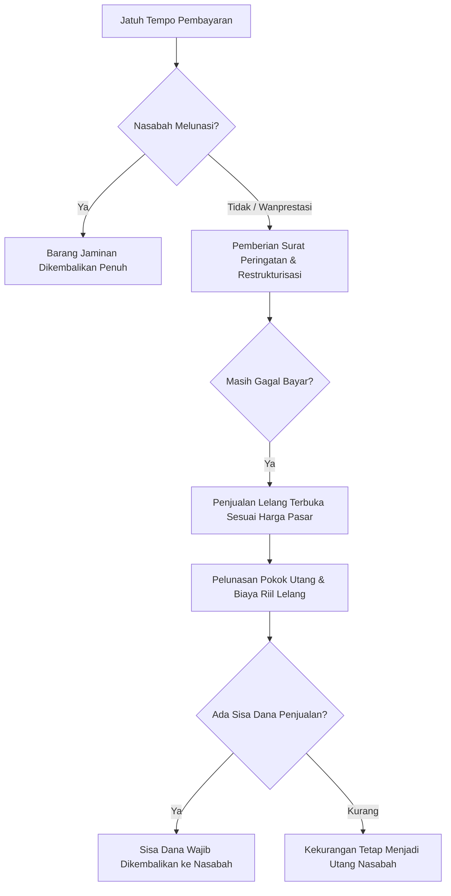

Kebutuhan likuiditas mendesak sering kali menghampiri siapa saja di tengah dinamika perekonomian yang serba cepat. Pelaku usaha mikro yang membutuhkan tambahan modal kerja dalam hitungan hari, kepala keluarga yang menghadapi tagihan pengobatan darurat, atau profesional muda yang memerlukan dana talangan singkat kerap mencari solusi pembiayaan yang cepat, berbiaya terjangkau, dan tidak rumit secara administratif. Dalam sistem keuangan konvensional, lembaga pegadaian dan rentenir menawarkan pinjaman berbunga dengan jaminan aset fisik, yang secara syariat jelas tergolong transaksi riba jahiliyyah yang diharamkan secara mutlak.

Untuk menjawab kebutuhan mendesak tersebut tanpa menabrak batas-batas syariat, industri perbankan syariah, Pegadaian Syariah, serta penyelenggara teknologi finansial syariah mengembangkan produk pembiayaan berbasis *Rahn* (gadai syariah) dan *Rahn Emas*. Melalui skema ini, nasabah dapat menyerahkan barang berharga miliknya sebagai jaminan pelunasan pinjaman tanpa harus kehilangan kepemilikan aset secara permanen.

Namun, di balik popularitas dan kemudahan proses gadai syariah modern, tersimpan perdebatan fiqh yang sangat krusial seputar penentuan biaya penitipan, pemeliharaan, dan penyimpanan barang jaminan (*ujrah ijarah al-hifdz wal-siyanah*). Banyak kalangan akademisi, pengawas syariah, dan masyarakat kritis mempertanyakan apakah biaya sewa tempat penyimpanan yang dihitung berdasarkan persentase nilai taksiran atau persentase plafon pinjaman telah terbebas murni dari riba, ataukah sekadar rekayasa hukum (*hilah ribawiyyah*) untuk memungut bunga pinjaman berkedok biaya administrasi.

Melalui artikel pilar yang komprehensif ini di [shl project](/tags/shl%20project), kita akan membedah secara tuntas anatomi fiqh akad rahn, landasan nash Al-Qur'an dan As-Sunnah, fatwa otoritatif Dewan Syari'ah Nasional Majelis Ulama Indonesia (DSN-MUI), standar syariah internasional AAOIFI, batasan kritis biaya pemeliharaan barang jaminan, simulasi matematis perhitungan biaya titip yang sahih, serta mitigasi risiko eksekusi aset wanprestasi secara adil dan bermartabat.

Sebelum mengurai problematika kontemporer, kita wajib meletakkan pemahaman mendasar mengenai hakikat rahn dalam khazanah fiqh klasik Islam.

## Fondasi dan Pengertian Akad Rahn dalam Tinjauan Syariat

Secara etimologi bahasa Arab, kata *rahn* (الرَّهْنُ) berakar dari makna *al-tsubut wa ad-dawam* (الثُّبُوتُ وَالدَّوَامُ) yang berarti tetap, kekal, dan berkesinambungan, atau *al-habs wal-luzum* (الْحَبْسُ وَاللُّزُومُ) yang bermakna penahanan sesuatu. Dalam konteks terminologi syariat, para fuqaha mendefinisikan rahn sebagai penahanan suatu harta benda yang bernilai ekonomis sebagai jaminan kebendaan atas hak utang, di mana utang tersebut memungkinkan untuk dilunasi seluruhnya atau sebagian darinya menggunakan hasil penjualan aset jaminan tersebut apabila pihak yang berutang mengalami gagal bayar.

Para ulama merumuskan definisi rahn dengan redaksi yang sangat presisi untuk menjaga esensi tolong-menolong tanpa mengeksploitasi pihak yang membutuhkan dana:

> **عَقْدٌ يَتَضَمَّنُ جَعْلَ عَيْنٍ مَالِيَّةٍ وَثِيقَةً بِدَيْنٍ يَسْتَوْفَى مِنْهَا عِنْدَ تَعَذُّرِ الْوَفَاءِ**\
> *"Sebuah akad yang menetapkan suatu aset fisik bernilai harta sebagai pengikat (jaminan) atas suatu piutang, yang pelunasan utang tersebut dapat diambil dari aset tersebut manakala debitur berhalangan atau gagal melunasi utangnya."* (Wahbah Az-Zuhaili, Al-Fiqh Al-Islami wa Adillatuh)

Akad rahn pada hakikatnya bukanlah akad komersial pencari keuntungan (*'aqd mu'awadhah*), melainkan akad jaminan kebendaan (*'aqd tauthsiq*) dan akad kebajikan (*'aqd tabarru'*). Tujuan utama pensyariatan rahn adalah memberikan rasa aman dan kepastian hak bagi pihak kreditur (*murtahin*) agar tidak ragu meminjamkan hartanya kepada debitur (*rahin*), sekaligus menghindarkan peminjam dari kehancuran ekonomi akibat ketiadaan akses dana darurat.

Dalam struktur hukum Islam, keberadaan jaminan tidak mengubah status utang pokok menjadi instrumen investasi yang boleh menghasilkan imbal hasil finansial bagi kreditur. Jaminan berfungsi murni sebagai pelindung risiko kredit macet, bukan mesin pencetak laba.

Setelah memahami definisi dasarnya, kita perlu menelaah dalil-dalil legitimasi syar'i yang menjadi pilar keabsahan akad rahn dalam Al-Qur'an dan Sunnah Nabawiyyah.

## Landasan Nash Al-Quran dan Hadits Shahih tentang Transaksi Gadai

Legitimasi pensyariatan akad rahn bersumber langsung dari nash-nash primer hukum Islam yang memiliki derajat keotentikan mutlak.

Allah Subhanahu wa Ta'ala secara eksplisit melegitimasi transaksi gadai dalam firman-Nya pada Surah Al-Baqarah ayat 283:

> **وَإِنْ كُنْتُمْ عَلَىٰ سَفَرٍ وَلَمْ تَجِدُوا كَاتِبًا فَرِهَانٌ مَقْبُوضَةٌ ۖ فَإِنْ أَمِنَ بَعْضُكُمْ بَعْضًا فَلْيُؤَدِّ الَّذِي اؤْتُمِنَ أَمَانَتَهُ وَلْيَتَّقِ اللَّهَ رَبَّهُ**\
> *"Dan jika kamu dalam perjalanan sedang kamu tidak memperoleh seorang penulis, maka hendaklah ada barang jaminan yang dipegang. Tetapi, jika sebagian kamu mempercayai sebagian yang lain, hendaklah yang dipercayai itu menunaikan amanatnya (utangnya) dan hendaklah ia bertakwa kepada Allah Tuhannya..."* (QS. Al-Baqarah 283)

Meskipun ayat tersebut menyebutkan konteks perjalanan (*safar*), ijma' (konsensus) ulama menetapkan bahwa pensyariatan gadai berlaku universal, baik dalam kondisi bepergian maupun saat mukim di daerah domisili. Penyebutan safar dalam ayat tersebut merupakan gambaran situasi umum di masa lampau ketika juru tulis perjanjian sulit ditemukan saat rombongan kafilah melintasi padang pasir.

Dalam tataran sunnah praktis, Rasulullah shallallahu 'alaihi wa sallam sendiri pernah melakukan transaksi gadai dengan seorang pedagang non-Muslim di Madinah untuk memenuhi kebutuhan pokok keluarga beliau. Hadits shahih riwayat Ummul Mukminin Aisyah radhiyallahu 'anha menggambarkan peristiwa agung tersebut:

> **تُوُفِّيَ رَسُولُ اللَّهِ صَلَّى اللَّهُ عَلَيْهِ وَسَلَّمَ وَدِرْعُهُ مَرْهُونَةٌ عِنْدَ يَهُودِيٍّ بِثَلَاثِينَ صَاعًا مِنْ شَعِيرٍ**\
> *"Rasulullah shallallahu 'alaihi wa sallam wafat dalam keadaan baju besi perang beliau sedang digadaikan kepada seorang Yahudi demi mendapatkan tiga puluh sha' gandum untuk makanan keluarganya."* (HR. Bukhari no. 2916 dan Muslim no. 1603)

Hadits mulia ini mengandung hikmah fiqh yang luar biasa dalam:

1. Menunjukkan keteladanan zuhud Rasulullah shallallahu 'alaihi wa sallam yang tidak menumpuk kemewahan duniawi hingga akhir hayat beliau.

2. Menegaskan kebolehan bertransaksi muamalah yang adil dengan kalangan non-Muslim (*ahlul kitab*) selama tidak melanggar rambu-rambu syariat.

3. Menetapkan keabsahan penyerahan aset fisik bernilai tinggi (baju besi perang) sebagai jaminan atas utang bahan pangan konsumtif.

Hadits fundamental lainnya yang menjadi pedoman utama hak dan kewajiban pemeliharaan barang gadai diriwayatkan dari sahabat Abu Hurairah radhiyallahu 'anhu:

> **الرَّهْنُ يُرْكَبُ بِنَفَقَتِهِ إِذَا كَانَ مَرْهُونًا وَلَبَنُ الدَّرِّ يُشْرَبُ بِنَفَقَتِهِ إِذَا كَانَ مَرْهُونًا وَعَلَى الَّذِي يَرْكَبُ وَيَشْرَبُ النَّفَقَةُ**\
> *"Barang gadaian boleh ditunggangi dengan mengeluarkan biaya nafkah perawatannya manakala ia digadaikan, dan air susu binatang perahan boleh diminum dengan mengeluarkan biaya nafkah perawatannya manakala ia digadaikan. Dan orang yang menunggangi serta meminum susunya wajib menanggung biaya nafkah perawatannya."* (HR. Bukhari no. 2512)

Hadits Abu Hurairah ini meletakkan prinsip keseimbangan mutlak antara beban biaya pemeliharaan (*al-ghurmu*) dan hak menikmati hasil atau manfaat (*al-ghunmu*), yang akan menjadi jangkar utama dalam menakar biaya penitipan barang jaminan modern.

Untuk mendalami struktur rukun dan syarat sahnya, mari kita bedah anatomi legalitas akad rahn menurut para ulama madzhab fiqh.

## Rukun dan Syarat Keabsahan Akad Rahn

Suatu transaksi gadai syariah dinyatakan sah dan mengikat (*lazim*) manakala seluruh rukun dan syarat yang digariskan oleh para fuqaha telah terpenuhi secara sempurna.

```infographic
infographic list-grid-badge-card
data
  items
    - label Rahin
      desc Debitur pemilik aset sah
      icon mdi/account-arrow-right
    - label Murtahin
      desc Kreditur pemegang jaminan
      icon mdi/bank-check
    - label Marhun
      desc Aset jaminan bernilai harta
      icon mdi/shield-lock
    - label Marhun Bih
      desc Piutang utang yang wajib dibayar
      icon mdi/cash-sync
```

Mayoritas ulama (Jumhur Fuqaha dari kalangan Maliki, Syafi'i, dan Hanbali) menetapkan empat rukun utama dalam akad rahn:

### 1 Pihak yang Berakad (Al-Aqidani)

Terdiri dari *Rahin* (orang yang menggadaikan barang / debitur) dan *Murtahin* (orang atau lembaga yang menerima barang gadaian / kreditur). Syarat utama kedua belah pihak adalah *ahliyyah al-ada'* (memiliki kecakapan hukum penuh), yaitu baligh, berakal sehat, merdeka, bertindak atas kehendak sendiri tanpa paksaan (*ikrah*), serta berhak membelanjakan hartanya (*rasyid* dan bukan di bawah pengampuan/ *mahjur 'alaih*).

### 2 Barang Jaminan (Al-Marhun)

Marhun adalah aset fisik atau kebendaan yang diserahkan sebagai jaminan. Syarat marhun meliputi:

* Berupa harta yang bernilai secara syariat (*mal mutaqawwim*). Benda haram seperti khamr, babi, atau aset hasil transaksi ilegal tidak sah dijadikan marhun.

* Berwujud nyata dan dapat diserahterimakan secara fisik (*mawjudan maqduran 'ala taslimih*).

* Dimiliki secara sah oleh rahin atau atas izin sah dari pemilik aslinya.

* Teridentifikasi dengan jelas (*ma'lum*) jenis, kualitas, kadar, dan spesifikasinya sehingga terhindar dari sengketa (*juhalah*).

* Tidak terikat dengan hak pihak ketiga yang dapat menghalangi eksekusi pelunasan utang.

### 3 Utang yang Dijamin (Al-Marhun Bih)

Marhun bih adalah hak piutang yang menjadi sebab diserahkannya barang jaminan. Syarat marhun bih antara lain:

* Merupakan kewajiban utang yang pasti atau mengikat (*dain lazim* atau *a-ilun ila al-luzum*).

* Jumlah atau nominalnya diketahui secara pasti oleh kedua belah pihak.

* Utang tersebut timbul dari transaksi yang halal (seperti utang piutang kebajikan *qardh*, sisa pembayaran jual beli tempo *murabahah*, atau sewa tertunggak *ijarah*), bukan utang akibat transaksi maksiat.

### 4 Ijab dan Qabul (Al-Sighah)

Pernyataan serah terima antara rahin dan murtahin yang menunjukkan kerelaan (*ridha*) kedua pihak untuk mengikatkan jaminan atas utang yang disepakati, baik diucapkan secara lisan, tertulis dalam dokumen resmi, maupun melalui media elektronik yang terverifikasi.

Setelah memahami rukun dan syarat dasarnya, kita perlu meninjau komparasi pandangan empat mazhab besar seputar status kepemilikan dan hak penahanan barang jaminan.

## Tinjauan Komparatif Empat Mazhab dan Standar AAOIFI No 39 tentang Status Marhun

Perkembangan hukum rahn dari masa klasik hingga era perbankan kontemporer memperlihatkan dinamika ijtihad yang sangat kaya di antara para imam mazhab.

```infographic
infographic list-grid-badge-card
data
  items
    - label Mazhab Hanafi
      desc Qabdh syarat kelaziman akad
      icon mdi/book-open-page-variant
    - label Mazhab Maliki
      desc Akad mengikat sebelum serah terima
      icon mdi/scale-balance
    - label Mazhab Syafii
      desc Marhun murni amanah ditangan murtahin
      icon mdi/shield-check
    - label Standar AAOIFI 39
      desc Standardisasi global rahn modern
      icon mdi/earth
```

### Pandangan Mazhab Hanafi

Para ulama Mazhab Hanafi memandang bahwa rukun rahn hakikatnya hanya satu, yaitu ijab dan qabul. Namun, akad rahn belum berstatus mengikat (*lazim*) melainkan baru berstatus *mauquf* hingga terjadi serah terima fisik barang (*al-qabdh*). Jika rahin telah menyerahkan marhun ke tangan murtahin, barulah akad menjadi mengikat dari sisi rahin (tidak boleh ditarik sepihak), tetapi tetap tidak mengikat bagi murtahin (kreditur berhak membebaskan jaminan kapan saja). Ulama Hanafi juga membedakan status tanggung jawab bila marhun rusak: jika rusak tanpa kelalaian, nilai utang gugur sebesar nilai terendah antara nilai barang atau nilai utang (*dhaman al-halak bi aqalli al-qimaytain*).

### Pandangan Mazhab Maliki

Imam Malik dan para pengikutnya berpendapat bahwa akad rahn telah mengikat secara sempurna sejak ijab qabul diucapkan, meskipun barang jaminan belum diserahterimakan secara fisik (*al-qabdh*). Rahin dapat dipaksa oleh pengadilan untuk menyerahkan barang jaminan yang telah dijanjikan dalam akad. Terkait barang yang tidak bisa disembunyikan (seperti rumah atau tanah), Mazhab Maliki membolehkan marhun tetap berada dalam penguasaan fisik rahin dengan pencatatan status jaminan (*rahn rasmi* / hipotik fidusia).

### Pandangan Mazhab Syafi'i

Menurut Mazhab Syafi'i, penyerahan fisik barang (*al-qabdh*) merupakan syarat sah berlakunya konsekuensi hukum rahn, bukan sekadar pelengkap. Kepemilikan barang (*milkiyyah al-'ain*) dan seluruh manfaat atau pertumbuhan aset (*nama' al-marhun*) tetap menjadi hak mutlak milik rahin. Tangan murtahin berstatus sebagai *yad amanah* (tangan penyimpan amanah). Murtahin tidak menanggung ganti rugi apa pun jika barang rusak di luar batas kesengajaan atau kelalaian murni (*ta'addi wa tafrith*).

### Pandangan Mazhab Hanbali

Imam Ahmad bin Hanbal berpandangan sejalan dengan Mazhab Syafi'i bahwa marhun adalah amanah di tangan murtahin dan kepemilikan tetap pada rahin. Namun, Mazhab Hanbali memiliki kekhususan dalam mengamalkan hadits Abu Hurairah radhiyallahu 'anhu: mereka membolehkan murtahin memanfaatkan hewan tunggangan atau meminum susu hewan perahan yang digadaikan kepadanya, dengan syarat murtahin mengeluarkan biaya nafkah pakan yang sebanding secara proporsional dengan manfaat yang diambilnya (*muqabalah an-nafaqah*), tanpa boleh mengambil keuntungan lebih.

### Standar Syariah Internasional AAOIFI No 39

Dewan Syariah AAOIFI (*Accounting and Auditing Organization for Islamic Financial Institutions*) merumuskan *Shariah Standard No. 39 tentang Al-Rahn Al-Tawthiqi* (Gadai Sebagai Jaminan Pengikat Utang). Standar internasional ini menegaskan:

1. Rahn adalah akad pengikat jaminan yang dapat diterapkan pada seluruh transaksi utang-piutang yang timbul secara sah.

2. Lembaga keuangan syariah dilarang keras mengambil keuntungan finansial apa pun dari penahanan barang jaminan.

3. Marhun dapat berupa aset berwujud (*a'yan*), surat berharga yang sah, piutang lancar, maupun saldo rekening simpanan.

4. Biaya penyimpanan dan pemeliharaan marhun wajib merefleksikan biaya riil aktual (*actual cost*) dan dilarang dikaitkan dengan besaran plafon utang.

Setelah menelaah komparasi mazhab dan standar global, kita masuk ke inti perdebatan fiqh paling krusial, yaitu kaidah larangan memetik keuntungan dari pinjaman utang.

## Kaidah Fiqh Kullu Qardhin Jarra Manfaatan Fahuwa Riba dan Bahaya Hilah Riba

Fondasi utama yang menjaga kemurnian akad sosial utang-piutang (*al-qardh*) dari kontaminasi eksploitasi finansial adalah kaidah ushul fiqh universal yang disepakati oleh seluruh fuqaha:

> **كُلُّ قَرْضٍ جَرَّ مَنْفَعَةً فَهُوَ رِبًا**\
> *"Setiap pinjaman utang-piutang yang menarik atau mensyaratkan adanya tambahan manfaat (keuntungan bagi pemberi pinjaman), maka tambahan tersebut adalah riba."*

Kaidah fiqh ini disarikan dari ijma' para sahabat Nabi dan ulama salaf, sebagaimana ditegaskan oleh Imam Ibnu Qudamah dalam kitab *Al-Mughni*:

> **أَجْمَعَ كُلُّ مَنْ يُحْفَظُ عَنْهُ مِنْ أَهْلِ الْعِلْمِ عَلَى أَنَّ الْمُشْتَرِطَ فِي الْقَرْضِ زِيَادَةً أَوْ هَدِيَّةً حَرَامٌ**\
> *"Seluruh ulama yang pendapatnya diakui telah bersepakat bahwa pihak yang mensyaratkan adanya tambahan pengembalian atau hadiah di dalam akad qardh adalah haram hukumnya."* (Ibnu Qudamah, Al-Mughni 4/360)

```infographic
infographic compare-binary-horizontal-simple-fold
data
  items
    - label Riba Qardh Terang
      desc Meminta bunga persentase pinjaman secara langsung
      icon mdi/cash-remove
    - label Hilah Riba Terselubung
      desc Memungut laba pinjaman berkedok biaya titip ijarah
      icon mdi/incognito
```

### Mengapa Kaidah Ini Sangat Menentukan dalam Produk Gadai

Akad pinjaman qardh dalam syariat Islam berakar dari konsep *tabarru'* (kebajikan sosial murni untuk menolong sesama). Ketika seseorang meminjamkan uang Rp10.000.000, maka pengembalian yang halal diterimanya adalah tepat Rp10.000.000 tanpa kelebihan satu rupiah pun.

Jika pemberi pinjaman meminta:

1. Bunga pinjaman langsung sebesar 1,5% per bulan, ini adalah *Riba Qardh* yang nyata (*jali*).

2. Biaya sewa tempat penitipan emas jaminan sebesar Rp150.000 per bulan yang dihitung dari 1,5% nominal pinjaman yang dicairkan, maka ini adalah *Hilah Riba* (rekayasa manipulatif untuk melegalkan riba secara terselubung).

Syariat Islam memandang substansi dan realitas hakiki dari suatu transaksi, bukan sekadar bungkus formalitas atau istilah yang disematkan padanya. Sebagaimana kaidah fiqh agung yang dirumuskan para ulama:

> **الْعِبْرَةُ فِي الْعُقُودِ لِلْمَقَاصِدِ وَالْمَعَانِي لَا لِلْأَلْفَاظِ وَالْمَبَانِي**\
> *"Yang menjadi patokan dalam akad-akad muamalah adalah maksud hakiki dan maknanya, bukan sekadar lafaz teks dan susunan formal katanya."*

Apabila biaya penitipan barang jaminan naik seiring bertambahnya nominal pinjaman—padahal fisik barang yang dititipkan sama persis dan volume ruang brankas yang terpakai tidak berubah—maka kelebihan biaya tersebut pada hakikatnya adalah bunga utang yang disamarkan dengan nama biaya sewa (*ujrah ijarah*).

Untuk memperjelas kedudukan hukum di Indonesia, mari kita pelajari fatwa resmi Dewan Syari'ah Nasional MUI yang mengatur akad rahn dan ijarah pemeliharaan.

## Anatomi Regulasi Fatwa DSN MUI No 25 dan No 26 Tahun 2002

Dewan Syari'ah Nasional Majelis Ulama Indonesia (DSN-MUI) telah menerbitkan dua fatwa utama yang menjadi landasan operasional dan kepatuhan syariah bagi seluruh lembaga keuangan di tanah air:

```infographic
infographic list-grid-badge-card
data
  items
    - label Fatwa DSN No 25 2002
      desc Ketentuan umum akad rahn dan pelarangan bunga
      icon mdi/file-document-check
    - label Fatwa DSN No 26 2002
      desc Rahn emas dan batasan sewa ijarah pemeliharaan
      icon mdi/gold
```

### 1 Fatwa DSN-MUI No 25/DSN-MUI/III/2002 tentang Rahn

Fatwa ini menetapkan ketentuan-ketentuan pokok mengenai akad gadai syariah:

* **Ketentuan Umum:** Pinjaman dengan menggadaikan barang sebagai jaminan utang dalam bentuk Rahn dibolehkan dengan ketentuan bahwa rahin menyerahkan marhun kepada murtahin sebagai jaminan.

* **Hak dan Kewajiban Pihak:** Marhun dan manfaatnya tetap menjadi milik rahin. Pada prinsipnya, marhun tidak boleh dimanfaatkan oleh murtahin kecuali atas seizin rahin dengan tidak mengurangi nilai marhun dan sekadar pengganti biaya pemeliharaan.

* **Pemeliharaan dan Penyimpanan:** Biaya pemeliharaan dan penyimpanan marhun pada dasarnya menjadi kewajiban rahin.

* **Penetapan Biaya:** Biaya penyimpanan dan pemeliharaan marhun yang ditanggung oleh rahin tidak boleh ditentukan berdasarkan jumlah pinjaman.

### 2 Fatwa DSN-MUI No 26/DSN-MUI/III/2002 tentang Rahn Emas

Fatwa ini secara spesifik mengatur praktik gadai emas yang sangat populer di perbankan syariah dan Pegadaian Syariah:

* **Legalitas Rahn Emas:** Rahn emas dibolehkan berdasarkan prinsip Rahn dengan ketentuan yang merujuk pada Fatwa DSN No. 25.

* **Penerapan Akad Ijarah:** Ongkos dan biaya penyimpanan barang jaminan (*marhun*) ditanggung oleh penggadai (*rahin*).

* **Penetapan Besaran Ongkos:** Ongkos penyimpanan barang jaminan didasarkan pada pengeluaran nyata yang jelas-jelas diperlukan untuk pemeliharaan dan penyimpanan barang tersebut.

* **Prinsip Sewa Tempat:** Biaya penyimpanan barang jaminan dilakukan melalui akad *Ijarah* (sewa jasa penyimpanan dan pemeliharaan fisik).

Kedua fatwa DSN-MUI tersebut dengan sangat tegas dan terang melarang pengaitan biaya simpan dengan besaran pinjaman. Pertanyaannya, bagaimana skema multi-akad (*hybrid contract*) ini diimplementasikan dalam struktur perbankan syariah modern?

## Konstruksi Multi Akad pada Gadai Syariah Modern

Dalam praktik industri keuangan syariah modern, produk gadai syariah (Rahn) dikonstruksikan melalui penggabungan tiga akad yang saling terpisah secara hukum (*tarkib al-uqud* yang proporsional dan tidak bertentangan):



Mari kita bedah fungsi masing-masing komponen akad dalam struktur tripartit ini:

### 1 Akad Qardh (Perjanjian Pinjam Meminjam Dana)

Akad qardh adalah akad kebajikan di mana lembaga keuangan syariah mencairkan sejumlah dana likuid kepada nasabah. Dana ini wajib dikembalikan oleh nasabah dalam jumlah yang persis sama pada saat jatuh tempo. Lembaga keuangan syariah dilarang mengambil margin keuntungan, bunga, atau komisi pinjaman dari akad qardh ini.

### 2 Akad Rahn (Perjanjian Pengikatan Agunan)

Akad rahn berfungsi sebagai akad pengaman (*tawtsiq*). Nasabah menyerahkan aset berharga miliknya (misalnya emas batangan, perhiasan, sertifikat, atau BPKB kendaraan) kepada lembaga keuangan syariah sebagai barang jaminan atas utang qardh yang diterimanya. Akad rahn ini memberikan hak preferen bagi lembaga keuangan untuk mengeksekusi marhun jika nasabah wanprestasi di kemudian hari.

### 3 Akad Ijarah (Perjanjian Sewa Jasa Penyimpanan dan Pemeliharaan)

Karena lembaga keuangan syariah menyediakan fasilitas keamanan tinggi, brankas tahan api (*safety deposit box*), ruang berpendingin khusus, tenaga sekuriti 24 jam, serta perlindungan asuransi perlindungan barang (*takaful*), maka nasabah menyewa jasa dan ruang penyimpanan fisik tersebut melalui akad ijarah. Atas jasa dan ruang yang disediakan, lembaga keuangan berhak memungut imbalan jasa (*ujrah*).

Kunci keabsahan seluruh rangkaian multi-akad ini terletak pada pemisahan independensi masing-masing akad (*adam at-ta'alluq*):

* Akad ijarah tidak boleh menjadi syarat mutlak yang mewajibkan penarikan keuntungan atas pinjaman qardh.

* Pembayaran ujrah ijarah harus sah berdiri sendiri sebagai kompensasi atas jasa riil pemeliharaan fisik marhun, bukan kompensasi atas pinjaman uang.

Lalu, bagaimana kita membedakan praktik perhitungan biaya titip yang terjerumus ke dalam riba terselubung dengan skema perhitungan yang sah menurut kaidah syariah?

## Titik Kritis Perhitungan Biaya Titip Ijarah dan Batasan Riba Terselubung

Ini adalah diskursus paling fundamental dalam operasional gadai syariah kontemporer. Banyak pihak terjebak pada formula praktis yang salah kaprah dalam menentukan biaya ijarah pemeliharaan marhun.

```infographic
infographic compare-binary-horizontal-simple-fold
data
  items
    - label Skema Terlarang
      desc Ujrah dihitung dari persentase uang pinjaman
      icon mdi/close-circle
    - label Skema Sah Ihsan
      desc Ujrah dihitung dari beban fisik riil brankas
      icon mdi/check-circle
```

### 1 Jebakan Skema Terlarang (Biaya Titip Berbasis Persentase Plafon Pinjaman)

Pada skema ini, lembaga menentukan tarif ujrah sewa tempat berdasarkan persentase uang yang dipinjam nasabah.

Contoh kasus:

* Nasabah A menitipkan emas 100 gram (nilai taksiran Rp130.000.000) dan meminjam dana Rp20.000.000.

* Nasabah B menitipkan emas 100 gram (nilai taksiran Rp130.000.000) dan meminjam dana Rp100.000.000.

Jika lembaga mengenakan tarif ujrah sebesar 1% per bulan dari **plafon pinjaman**:

* Nasabah A membayar biaya titip: 1% x Rp20.000.000 = Rp200.000 per bulan.

* Nasabah B membayar biaya titip: 1% x Rp100.000.000 = Rp1.000.000 per bulan.

**Analisis Kritis Syariah:**\
Fisik emas yang dititipkan oleh Nasabah A dan Nasabah B sama persis (100 gram), volume brankas yang terpakai sama persis, risiko pengamanan fisik sama persis, dan premi asuransi fisik emas sama persis. Namun mengapa Nasabah B harus membayar 5 kali lipat lebih mahal daripada Nasabah A? Perbedaan selisih Rp800.000 tersebut murni timbul karena Nasabah B meminjam uang lebih banyak. Inilah bukti tak terbantahkan bahwa kelebihan biaya tersebut merupakan **Riba Qardh yang disamarkan** (*hilah ribawiyyah*). Skema ini **haram secara mutlak** dan bertentangan langsung dengan Fatwa DSN-MUI No. 25 dan No. 26.

### 2 Jebakan Skema Perdebatan (Biaya Titip Berbasis Persentase Nilai Taksiran Barang)

Sebagian lembaga pegadaian menerapkan perhitungan biaya ijarah berdasarkan persentase nilai taksiran emas (misalnya Rp1.200 per Rp10.000 nilai taksiran per 15 hari).

* Jika nasabah menitipkan emas 100 gram, biaya titipnya sama baik ia meminjam Rp10.000.000 maupun Rp100.000.000.

* Pendekatan ini lebih baik daripada skema pertama karena tidak terikat langsung dengan plafon pinjaman.

Namun, para fuqaha kontemporer dan pengawas syariah kritis tetap memberikan catatan keras: nilai taksiran rupiah emas tidak mencerminkan biaya operasional penyimpanan fisik. Jika harga emas dunia melonjak dua kali lipat dalam satu tahun, apakah biaya listrik brankas dan gaji satpam otomatis naik dua kali lipat? Tentu tidak. Maka pengaitan dengan nilai taksiran masih mengandung syubhat *ribawiyyah* jika selisihnya terlalu jauh di atas biaya riil aktual.

### 3 Skema Sahih dan Murni Syar'i (Biaya Titip Berbasis Beban Fisik Riil, Volume, dan Asuransi)

Dalam skema yang sepenuhnya sesuai dengan maqashid syariah dan fatwa ulama internasional, ujrah ijarah dihitung berdasarkan variabel riil fisik penyimpanan:

1. **Biaya Sewa Volume/Dimensi Fisik (Per Kubikasi / Per Slot Brankas):** Menghitung ukuran ruang brankas atau luas area gudang penyimpanan (m2 atau cm3).

2. **Biaya Administrasi Aktual (*****Direct Actual Administrative Expense*****):** Biaya pencatatan, verifikasi kadar uji karat emas, segel kantong pengaman, dan penerbitan surat bukti rahn.

3. **Biaya Premi Takaful/Asuransi Riil:** Biaya perlindungan marhun atas risiko kebakaran, perampokan, atau kehilangan yang dibayarkan langsung kepada perusahaan asuransi syariah pihak ketiga.

Dengan formula murni ini, lembaga keuangan syariah memperoleh pendapatan jasa yang 100% halal, adil, transparan, dan bersih dari segala syubhat riba utang-piutang.

Untuk melihat implementasi matematisnya, mari kita susun simulasi komparatif yang detail dan realistis.

## Model Matematis dan Simulasi Perhitungan Biaya Titip yang Sahih

Mari kita susun sebuah model simulasi komparatif untuk menguji transparansi dan keadilan perhitungan biaya penitipan antara skema konvensional/syubhat dengan skema biaya riil syariah.

### Parameter Simulasi Pembiayaan Rahn Emas

* **Aset Jaminan (Marhun):** Emas batangan Antam 50 gram (kadar 99,99%).

* **Harga Pasar Emas saat Taksiran:** Rp1.300.000 per gram.

* **Nilai Taksiran Total Marhun:** 50 gram x Rp1.300.000 = Rp65.000.000.

* **Maksimal Plafon Pinjaman (*****Financing to Value*****&#x20;80%):** Rp52.000.000.

* **Jangka Waktu Gadai:** 120 hari (4 bulan), dibagi dalam periode perhitungan per 15 hari (total 8 periode).

Kita akan membandingkan dua nasabah dengan jaminan emas yang identik (50 gram):

* **Kasus Nasabah 1:** Meminjam dana Rp10.000.000 (penarikan pinjaman rendah).

* **Kasus Nasabah 2:** Meminjam dana Rp50.000.000 (penarikan pinjaman tinggi).

```infographic
infographic list-grid-candy-card-lite
data
  items
    - label Kasus Nasabah 1
      desc Pinjam 10 juta jaminan 50g emas
      icon mdi/account-cash
    - label Kasus Nasabah 2
      desc Pinjam 50 juta jaminan 50g emas
      icon mdi/account-cash-outline
```

### Tabel Komparasi Skema Keliru (Persentase Pinjaman) vs Skema Sahih (Biaya Riil Fisik)

Berikut rincian perhitungan biaya selama masa gadai 120 hari (4 bulan):

| Parameter Evaluasi                   | Skema Keliru (1% Plafon / Bulan) Nasabah 1 | Skema Keliru (1% Plafon / Bulan) Nasabah 2 | Skema Sahih (Biaya Riil Brankas & Takaful) Nasabah 1 | Skema Sahih (Biaya Riil Brankas & Takaful) Nasabah 2 |
| ------------------------------------ | ------------------------------------------ | ------------------------------------------ | ---------------------------------------------------- | ---------------------------------------------------- |
| **Plafon Pinjaman Qardh**            | Rp10.000.000                               | Rp50.000.000                               | Rp10.000.000                                         | Rp50.000.000                                         |
| **Fisik Jaminan Emas**               | 50 Gram                                    | 50 Gram                                    | 50 Gram                                              | 50 Gram                                              |
| **Sewa Slot Brankas (4 Bln)**        | Rp0 (terselubung)                          | Rp0 (terselubung)                          | Rp120.000 (Rp30.000/bln)                             | Rp120.000 (Rp30.000/bln)                             |
| **Premi Asuransi Takaful Riil**      | Rp0 (terselubung)                          | Rp0 (terselubung)                          | Rp80.000 (Rp20.000/bln)                              | Rp80.000 (Rp20.000/bln)                              |
| **Admin & Uji Karat Awal**           | Rp50.000                                   | Rp50.000                                   | Rp50.000 (1 kali di awal)                            | Rp50.000 (1 kali di awal)                            |
| **Total Biaya Ujrah Ijarah (4 Bln)** | **Rp400.000**                              | **Rp2.000.000**                            | **Rp200.000**                                        | **Rp200.000**                                        |
| **Total Pengembalian Utang**         | Rp10.450.000                               | Rp52.050.000                               | Rp10.250.000                                         | Rp50.250.000                                         |
| **Status Hukum Fiqh**                | **Haram (Riba Qardh)**                     | **Haram (Riba Qardh)**                     | **Sahih Halal Murni**                                | **Sahih Halal Murni**                                |

### Analisis Hasil Simulasi

1. Pada skema keliru, Nasabah 2 dipaksa membayar biaya sewa Rp2.000.000 untuk menitipkan sekeping emas 50 gram, sedangkan Nasabah 1 hanya membayar Rp400.000 untuk sekeping emas dengan dimensi dan berat yang persis sama. Selisih Rp1.600.000 tersebut nyata-nyata adalah bunga pinjaman uang yang dieksploitasi dari kebutuhan likuiditas Nasabah 2.

2. Pada skema sahih yang menerapkan prinsip biaya riil, baik Nasabah 1 maupun Nasabah 2 membayar biaya pemeliharaan dan asuransi yang adil dan sama persis, yaitu Rp200.000 untuk 4 bulan (ditambah admin awal Rp50.000). Lembaga pengelola mendapatkan keuntungan jasa sewa brankas secara halal, sementara nasabah terlindungi dari jeratan riba.

Untuk barang jaminan berukuran besar seperti kendaraan bermotor atau mesin pabrik, bagaimana formula perhitungan berbasis luas area fisik diaplikasikan?

## Formula Perhitungan Ujrah Berbasis Luas Area Gudang dan Kubikasi Fisik

Pada pembiayaan gadai syariah dengan jaminan kendaraan bermotor (mobil/motor), mesin produksi, atau stok komoditas perdagangan, biaya penitipan wajib dihitung menggunakan formula luas lantai (*square meter*) atau volume ruang (*cubic meter*) yang secara aktual digunakan.

```infographic
infographic list-grid-badge-card
data
  items
    - label Luas Lantai
      desc Tarif per meter persegi area parkir
      icon mdi/floor-plan
    - label Durasi Waktu
      desc Hari atau bulan penyimpanan aktif
      icon mdi/clock-time-four-outline
    - label Asuransi Fisik
      desc Premi perlindungan kebakaran kehilangan
      icon mdi/shield-car
    - label Total Ujrah Adil
      desc Biaya riil tanpa kaitan nilai utang
      icon mdi/calculator
```

### Rumus Matematis Biaya Titip Kendaraan / Barang Curah

Biaya penitipan barang jaminan fisik besar dapat diformulasikan sebagai berikut:

> **Total Biaya Titip = (Luas Ruang Terpakai x Tarif Sewa Gudang per Hari x Jumlah Hari) + Premi Asuransi Takaful + Biaya Operasional Perawatan Rutin**

Di mana:

* **Luas Ruang Terpakai ($A$):** Dihitung dalam satuan $m^2$ sesuai dimensi fisik aset jaminan ditambah ruang manuver standar pengamanan gudang.

* **Tarif Sewa Gudang ($R$):** Biaya sewa ruang per meter persegi per hari yang mencakup penyusutan gedung, biaya listrik pendingin/ventilasi, dan gaji petugas keamanan.

* **Biaya Perawatan Rutin ($M$):** Biaya pemanasan mesin mobil secara berkala, pencucian debu, atau pengecekan tekanan angin ban untuk menjaga agar aset tidak mengalami depresiasi fungsi selama masa gadai.

### Contoh Penerapan Nyata Gadai Mobil

* Nasabah menggadaikan sebuah mobil MPV keluarga dengan dimensi panjang 4,5 meter x lebar 1,8 meter.

* Area parkir gudang aman yang dialokasikan: 10 $m^2$.

* Tarif sewa gudang aman: Rp15.000 per $m^2$ per bulan = Rp150.000 per bulan.

* Biaya perawatan rutin (pemanasan mesin 2x seminggu): Rp50.000 per bulan.

* Premi asuransi kebakaran dan kehilangan gudang: Rp100.000 per bulan.

* **Total Ujrah Ijarah Sahih:** Rp300.000 per bulan.

Biaya Rp300.000 per bulan ini berlaku tetap, baik nasabah meminjam dana darurat Rp15.000.000 maupun Rp100.000.000. Inilah model keadilan muamalah syariah yang menjaga integritas kedua belah pihak.

Selanjutnya, kita perlu menelaah hak pemanfaatan barang gadai, apakah kreditur berhak memakai aset jaminan tersebut selama berada di tangannya?

## Hak Pemanfaatan dan Batasan Penggunaan Marhun

Salah satu pertanyaan klasik yang kerap muncul di masyarakat adalah: Apakah pihak yang memegang barang gadai (*murtahin*) berhak memakai motor, mengendarai mobil, menempati rumah, atau menggarap sawah yang digadaikan kepadanya?

Para fuqaha empat mazhab telah meletakkan kaidah tegas mengenai pemanfaatan marhun:

```infographic
infographic compare-binary-horizontal-simple-fold
data
  items
    - label Aset Non Biaya
      desc Rumah mobil tanah haram dipakai murtahin
      icon mdi/cancel
    - label Aset Hewan Nafkah
      desc Boleh ditunggangi sebatas pengganti pakan
      icon mdi/horse
```

### 1 Prinsip Dasar Kepemilikan Barang

Status kepemilikan aset jaminan (*milkiyyah al-'ain*) dan seluruh manfaat yang melekat padanya adalah hak eksklusif milik debitur (*rahin*). Murtahin hanya memiliki hak penahanan (*haqq al-ihtibas*) sebagai jaminan pelunasan utang, bukan hak milik (*haqq al-milkiyyah*) dan bukan pula hak guna pakai (*haqq al-intifa'*).

### 2 Larangan Murtahin Memanfaatkan Marhun Non-Biaya

Jika barang jaminan berupa barang yang tidak membutuhkan biaya perawatan hidup (seperti emas, perhiasan, rumah, mobil, motor, tanah, atau peralatan elektronik), maka **murtahin diharamkan secara mutlak** untuk memanfaatkan barang tersebut, meskipun rahin memberikan izin secara sukarela.

Mengapa izin rahin tidak membolehkan pemanfaatan tersebut? Karena izin tersebut diberikan dalam konteks utang-piutang (*qardh*). Pemanfaatan rumah atau kendaraan rahin oleh murtahin dinilai sebagai manfaat tambahan atas utang yang dipinjamkannya, sehingga jatuh ke dalam kaidah *kullu qardhin jarra manfa'atan fahuwa riba*.

Imam Ibnu Abdil Barr dalam kitab *Al-Istidzkar* menegaskan:

> **كُلُّ زِيَادَةٍ فِي سَلَفٍ أَوْ مَنْفَعَةٍ يَنْتَفِعُ بِهَا الْمُسَلِّفُ فَهِيَ رِبًا لَا خِلَافَ فِيهِ**\
> *"Setiap tambahan dalam utang atau manfaat apa pun yang dinikmati oleh pihak yang memberi pinjaman utang, maka hal itu adalah riba tanpa ada perselisihan ulama di dalamnya."* (Al-Istidzkar 6/516)

### 3 Pengecualian pada Hewan Bernafkah (Mazhab Hanbali)

Sebagaimana telah disinggung pada hadits Abu Hurairah radhiyallahu 'anhu, jika marhun berupa hewan ternak yang memerlukan biaya pakan dan perawatan harian (seperti sapi perah atau kuda), dan rahin menolak atau tidak mampu membiayai pakannya, maka murtahin yang menanggung biaya pakan tersebut diperbolehkan mengambil susu atau menungganginya dengan syarat:

* Pemanfaatan tersebut bernilai seimbang dan sebanding dengan biaya riil pakan yang dikeluarkannya (*bi qadri nafaqatiha*).

* Tidak boleh mengambil manfaat melebihi biaya pakan yang dikeluarkan, karena kelebihannya adalah riba.

Setelah memahami hak pemanfaatan, kita melangkah ke tahapan krusial berikutnya, yaitu bagaimana mitigasi syariah manakala nasabah mengalami gagal bayar saat jatuh tempo.

## Prosedur Eksekusi Marhun Saat Nasabah Wanprestasi dan Larangan Sita Sepihak

Dalam perjalanannya, tidak semua pembiayaan berjalan mulus. Ada kalanya nasabah (*rahin*) mengalami kesulitan keuangan yang parah sehingga tidak mampu melunasi kewajiban utangnya pada saat tanggal jatuh tempo yang telah diperjanjikan.

Bagaimana syariat Islam mengatur proses eksekusi barang jaminan agar tidak terjadi kezaliman terhadap nasabah yang sedang terpuruk?



### 1 Tahapan Peringatan dan Restrukturisasi

Ketika nasabah menunggak, lembaga keuangan syariah tidak boleh langsung menyita atau menjual barang jaminan secara membabi buta. Lembaga wajib menjalankan prosedur peringatan secara bertahap:

* Mengirimkan Surat Pemberitahuan Jatuh Tempo dan Surat Peringatan (SP 1, SP 2, SP 3).

* Memberikan masa tenggang (*grace period*) yang wajar bagi nasabah untuk mengupayakan pelunasan.

* Menawarkan opsi restrukturisasi pembiayaan atau perpanjangan jangka waktu akad (*tajdid al-aqd*) jika nasabah memiliki itikad baik namun mengalami kendala likuiditas sementara.

### 2 Penjualan Lelang Terbuka (Al-Bai' bil-Muzayadah)

Jika masa tenggang telah berakhir dan nasabah tetap tidak mampu melunasi utangnya, marhun dapat dieksekusi melalui penjualan lelang umum yang transparan:

* Penjualan dilakukan atas izin rahin atau melalui ketetapan juru lelang resmi/pengadilan jika rahin menghilang atau menolak bekerja sama.

* Penjualan wajib mengacu pada harga pasar wajar (*fair market value*), bukan dengan harga obral yang merugikan nasabah.

### 3 Pembagian Hasil Penjualan Lelang

Hasil penjualan lelang marhun dialokasikan dengan urutan prioritas hukum sebagai berikut:

1. **Pelunasan Pokok Utang:** Menutup sisa saldo utang qardh yang belum terbayar.

2. **Penggantian Biaya Riil Lelang dan Simpan Terutang:** Membayar biaya administrasi juru lelang resmi dan tunggakan sewa brankas riil yang sah.

3. **Pengembalian Surplus kepada Nasabah:** Apabila hasil penjualan lebih besar daripada total utang dan biaya riil lelang, maka **kelebihan dana tersebut 100% wajib dikembalikan kepada nasabah (*****rahin*****)**. Lembaga keuangan syariah diharamkan secara mutlak mengambil atau menikmati sisa uang kelebihan lelang tersebut.

4. **Klaim Defisit Utang:** Apabila hasil penjualan marhun ternyata lebih kecil daripada total utang nasabah, maka sisa utang yang belum tertutup tetap menjadi kewajiban utang biasa bagi rahin yang wajib dilunasi di masa depan manakala ia telah memiliki kelapangan.

### 4 Larangan Mutlak Sita Sepihak (*Pactum Commissorium*)

Dalam hukum Islam dan hukum positif Indonesia, klausul sita sepihak otomatis (*ghuluw al-marhun* atau *pactum commissorium*)—di mana barang jaminan otomatis menjadi milik kreditur jika debitur gagal bayar tanpa memperhitungkan selisih harga pasar—adalah **batal demi hukum dan haram**.

Rasulullah shallallahu 'alaihi wa sallam bersabda:

> **لَا يُغْلَقُ الرَّهْنُ مِنْ صَاحِبِهِ الَّذِي رَهَنَهُ لَهُ غُنْمُهُ وَعَلَيْهِ غُرْمُهُ**\
> *"Barang gadaian itu tidak boleh tertutup (terhalang kepemilikannya) dari pemilik yang menggadaikannya. Baginyalah keuntungan aset tersebut dan atasnyalah kerugian perawatannya."* (HR. Asy-Syafi'i dalam Al-Umm 3/147, Ad-Daruquthni no. 2883, dan Al-Hakim 2/21)

Larangan ini melindungi masyarakat lemah dari praktik pemerasan rentenir yang merampas aset bernilai ratusan juta rupiah hanya gara-gara utang pokok puluhan juta rupiah yang tertunggak.

Untuk memahami bagaimana lembaga syariah menangani nasabah yang menunda-nunda pembayaran secara sengaja, mari kita telaah perbedaan antara denda riba dengan ta'widh kerugian riil.

## Penanganan Nasabah Menunda Pembayaran Gharamah vs Tawidh

Dalam operasional perbankan syariah modern, terdapat tantangan nasabah yang memiliki kemampuan finansial namun sengaja menunda-nunda pembayaran utangnya (*al-mathl*).

Rasulullah shallallahu 'alaihi wa sallam bersabda mengenai perilaku zalim ini:

> **مَطْلُ الْغَنِيِّ ظُلْمٌ**\
> *"Penundaan pembayaran utang oleh orang yang mampu adalah sebuah kezaliman."* (HR. Bukhari no. 2287 dan Muslim no. 1564)

Bagaimana lembaga keuangan syariah memberikan efek jera tanpa terjerumus ke dalam praktik denda bunga konvensional?

```infographic
infographic list-grid-badge-card
data
  items
    - label Tawidh Kerugian Riil
      desc Ganti rugi biaya nyata penagihan
      icon mdi/cash-refund
    - label Gharamah Sanksi Finansial
      desc Denda disalurkan 100 persen dana sosial
      icon mdi/hand-heart
```

Berdasarkan Fatwa DSN-MUI No. 43/DSN-MUI/VIII/2004 tentang Ganti Rugi (*Ta'widh*) dan Fatwa DSN-MUI No. 17/DSN-MUI/IX/2000 tentang Sanksi atas Nasabah Mampu yang Menunda Pembayaran:

### 1 Ta'widh (Ganti Rugi Riil Aktual)

Lembaga keuangan syariah diperbolehkan menuntut ganti rugi atas biaya riil yang nyata-nyata dikeluarkan oleh lembaga dalam rangka menagih hak utang dari nasabah yang wanprestasi (misalnya biaya transportasi juru tagih resmi, biaya somasi legal advokat, atau biaya kurir surat resmi). Nilai ta'widh harus didasarkan pada kerugian riil (*actual loss*) yang dapat dibuktikan secara akuntansi, bukan perkiraan potensi keuntungan yang hilang (*opportunity loss*). Dana ta'widh ini diakui sebagai pendapatan pemulihan biaya operasional lembaga.

### 2 Gharamah (Sanksi Denda Finansial)

Lembaga keuangan syariah dapat mengenakan sanksi denda finansial kepada nasabah mampu yang sengaja menunda pembayaran untuk mendisiplinkan moral debitur. Namun, dana hasil denda *gharamah* tersebut **dilarang keras diakui sebagai pendapatan laba lembaga**. Seluruh dana denda keterlambatan wajib disalurkan 100% ke rekening dana kebajikan sosial (*qardhul hasan* / dana sosial kebajikan) untuk disalurkan kepada fakir miskin, beasiswa pendidikan, atau fasilitas kemaslahatan umat.

Dengan pemisahan yang sangat ketat ini, lembaga keuangan syariah terbebas murni dari memakan harta riba dari denda keterlambatan pembayaran utang nasabah.

Setelah membedah seluruh aspek fiqh, operasional, dan mitigasi risiko, mari kita susun panduan praktis bagi masyarakat cerdas dalam memilih layanan gadai syariah.

## Panduan Praktis dan Checklist Memilih Layanan Gadai Syariah Terpercaya

Bagi kamu yang sedang mempertimbangkan untuk memanfaatkan produk gadai syariah guna memenuhi kebutuhan dana darurat atau permodalan usaha, berikut checklist kepatuhan syariah yang wajib kamu periksa sebelum menandatangani akad:

```infographic
infographic list-grid-badge-card
data
  items
    - label Dewan Syariah
      desc Pastikan diawasi DPS DSN MUI
      icon mdi/shield-crown
    - label Rumus Biaya Titip
      desc Bebas dari persentase pinjaman utang
      icon mdi/calculator-variant
    - label Perjanjian Transparan
      desc Klausul lelang adil tanpa sita sepihak
      icon mdi/file-sign
    - label Izin Resmi OJK
      desc Terdaftar berizin legalitas aman
      icon mdi/certificate
```

### Checklist 5 Pilar Kepatuhan Gadai Syariah

1. **Verifikasi Legalitas dan Pengawasan Syariah:** Pastikan lembaga keuangan, unit pegadaian syariah, atau platform fintech lending syariah yang kamu tuju telah terdaftar dan berizin resmi di Otoritas Jasa Keuangan (OJK) serta memiliki Dewan Pengawas Syariah (DPS) yang direkomendasikan oleh DSN-MUI.

2. **Cermati Rumus Penghitungan Biaya Ujrah:** Periksa dokumen rincian biaya. Pastikan tarif biaya titip tidak dihitung secara linier berdasarkan nominal uang pinjaman yang kamu tarik. Tanyakan secara kritis dasar perhitungan sewa brankas dan asuransinya.

3. **Hindari Lembaga dengan Klausul Sita Sepihak:** Pastikan dalam kontrak tertulis dengan tegas bahwa jika terjadi gagal bayar, barang akan dilelang secara transparan dan sisa kelebihan uang lelang wajib ditransfer kembali ke rekening pribadimu.

4. **Periksa Kejelasan Polis Asuransi Barang Jaminan:** Pastikan emas atau aset berharga yang kamu serahkan dilindungi oleh asuransi syariah (*takaful*) resmi terhadap risiko kehilangan, kebakaran, atau kerusakan selama berada dalam brankas pengelola.

5. **Sesuaikan dengan Kemampuan Arus Kas Pribadi:** Gadai syariah adalah solusi likuiditas jangka pendek, bukan sarana gali lubang tutup lubang jangka panjang. Pastikan kamu telah memiliki rencana arus kas (*cash flow plan*) yang matang untuk melunasi pokok pinjaman sebelum masa jatuh tempo berakhir.

Sebelum kita menutup pembahasan panjang ini, mari kita rangkum seluruh intisari pilar fiqh yang telah kita bedah bersama dalam sebuah kesimpulan yang kokoh.

## Rekapitulasi Pokok Fiqh Rahn dan Menjaga Keberkahan Finansial

Akad Rahn (gadai syariah) merupakan instrumen muamalah agung yang dirancang oleh syariat Islam sebagai sarana tolong-menolong (*ta'awun*) dan pengamanan hak utang piutang tanpa menindas pihak yang sedang membutuhkan pertolongan likuiditas.

Poin-poin kunci yang menjadi intisari pembahasan kita meliputi:

* **Hakikat Rahn:** Akad jaminan kebendaan (*tawtsiq*) yang bersifat sosial kebajikan (*tabarru'*), bukan akad komersial pencari keuntungan pinjaman.

* **Larangan Riba Qardh:** Setiap penambahan imbal hasil atau keuntungan yang disyaratkan atas pinjaman utang pokok adalah riba yang diharamkan secara mutlak (*kullu qardhin jarra manfa'atan fahuwa riba*).

* **Batasan Ijarah Pemeliharaan:** Biaya penyimpanan dan pemeliharaan marhun wajib didasarkan pada biaya riil aktual (sewa ruang fisik brankas, pengamanan, administrasi nyata, dan asuransi takaful), serta dilarang keras dihitung berdasarkan persentase nominal utang pinjaman yang ditarik nasabah.

* **Hak Milik Tetap pada Nasabah:** Aset jaminan dan manfaatnya tetap menjadi milik sah rahin. Murtahin diharamkan memanfaatkan aset jaminan non-biaya untuk kepentingan pribadinya.

* **Keadilan Eksekusi Lelang:** Eksekusi wanprestasi wajib melalui lelang terbuka sesuai harga pasar wajar, di mana sisa kelebihan hasil lelang wajib dikembalikan seutuhnya kepada nasabah dan dilarang disita sepihak.

Dengan memahami dan menerapkan prinsip-prinsip fiqh muamalah secara jujur, konsisten, dan transparan, kita dapat mewujudkan ekosistem keuangan syariah modern yang tidak sekadar berlabel halal di atas kertas, melainkan benar-benar menghadirkan keadilan sosial, keberkahan harta, dan ketenangan jiwa bagi seluruh umat.
